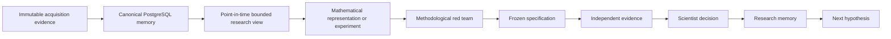

# Market Model Evaluation Harness

## Scientific quantitative research infrastructure

This is a short-horizon quantitative research laboratory for liquid U.S. equities. Its purpose is to discover measurable market structure, attempt to falsify it, preserve the scientific record, and advance only the effects or methods that survive increasingly difficult tests.

The implementation and active research programme remain private. This case study presents the architecture, operating rules, selected completed research, publication work, and current scientific boundaries.

This is independent research infrastructure, not an operating investment business or a production trading system.

## My role

I own the research thesis, experimental rules, information boundaries, architecture constraints, acceptance criteria, and research decisions for the laboratory. I review implementation and evidence against those rules, including whether a result is promoted, narrowed, rejected, corrected, or closed.

**Period:** active quantitative research programme, 2026.  
**Current status:** the local research laboratory is operational, the 200-equity frozen baseline is represented in canonical PostgreSQL memory, the OCaml research engine is executable, scientific-lifecycle integrity is enforced by deterministic repository-wide verification, and the research programme has progressed into prospectively registered statistical-methodology and publication work. This remains research infrastructure, not a production trading system.

## Research objective

The long-run objective is to build a research process capable of repeatedly discovering, falsifying, validating, monitoring, and retiring independent market effects and statistical methods.

Models are disposable. Individual hypotheses are disposable. A valid effect may also be temporary. The durable asset is the process that can distinguish an interesting observation from a reproducible state, a predictive effect, a valid statistical instrument, and eventually an economically executable source of alpha.

```text
observe structure
-> formulate a falsifiable claim
-> attack the method
-> freeze the experiment
-> test independent evidence
-> accept, narrow, correct, or reject
-> test prediction
-> test economics
-> monitor decay
-> preserve what was learned
-> repeat
```

A high rejection rate is compatible with a productive research programme. The objective is to learn what is false cheaply enough that research effort can move to better questions.

## Current laboratory

The canonical intraday environment contains:

- **200 liquid U.S. equities** in a versioned research universe
- approximately **720 calendar days** of history
- native **5-minute regular-session bars**
- **7,659,672 frozen baseline bars**
- Alpaca SIP historical data as acquisition evidence
- PostgreSQL as canonical research memory
- immutable source evidence with content hashes and provenance

The research stack is primarily OCaml 5.2+ with PostgreSQL. Python is used selectively where provider or scientific tooling makes it the appropriate boundary language.

The repository also contains a daily Pattern Engine with directional sequence, turning-angle, and triangle/path-ratio detector families. The daily detector system and the 5-minute intraday research laboratory are separate scientific surfaces and do not silently inherit authority from one another.

## System shape



At research time `T`, the experiment receives only information available at or before `T`. Retrospective evaluation may inspect later observations after the candidate or state has been fixed. Future observations cannot alter what the original experiment was allowed to know.

## Scientific memory

A research programme can become unreliable even when every individual file is preserved. The difficult problem is remembering which result was provisional, which evidence has already been exposed, which interpretation was later corrected, what a branch actually ruled out, and what remains genuinely untested.

The laboratory therefore maintains a deterministic, Git-native scientific memory layer. It records six distinct object classes:

```text
Hypothesis       the question being asked
Experiment       what ran and under what authority
Result           machine verdict and scientist acceptance
Lesson           what later research should retain
Branch           what a research family established or exhausted
EvidenceExposure which evidence has already been spent
```

Machine output and scientific conclusion are deliberately separate. Evidence that has been inspected cannot later be presented as untouched confirmation. A closed branch records both what was ruled out and what remains untested.

Before new work advances, the system can render a deterministic Context Pack from this graph. The pack reconstructs relevant lineage, prior results, lessons, evidence exposure, closure state, and unresolved questions without semantic search, embeddings, an LLM, market-data access, or network access.

The lifecycle is executable. Repository-wide verification fails closed when scientific state is internally inconsistent, evidence authority is invalid, or frozen experiment identity has been altered.

## Current publication work

The research programme has progressed beyond infrastructure and market-candidate screening into a prospectively registered statistical-methodology paper on **studentizing a double cross-fit estimator of expected conditional covariance with fixed-k nearest neighbours**.

The current fixed-k studentizer paper is preserved as **Baseline V1** and is the active publication priority. Its registered N4 validation has been accepted within the research process, while an earlier temporal-transport research identity remains preserved separately rather than being rewritten as if it never existed.

The manuscript has undergone multiple adversarial and reproducibility passes, including a comprehensive sixth re-audit covering registered-table fidelity, numerical rounding, citation scope, reproduction disclosures, proof presentation, production formatting, embedded fonts, and residual-diff review. Corrections are recorded append-only when they affect historical interpretation. The research lineage explicitly distinguishes the active fixed-k paper from the paused earlier programme so one registration cannot be used as authority for another.

That publication work is important because the same governance rules used for market research are being applied to statistical research: freeze identities, separate prospective from post-hoc evidence, preserve exposed evidence, record corrections, and refuse to turn a repaired experiment into an untouched one.

## Selected research record

### Magnitude and activity structure

An early frozen experiment tested whether clock-normalized return magnitude, volume, and trade count contained persistent within-session structure, and whether a joint magnitude/activity state added information beyond the marginals.

The machine initially reported `PASS_PRIMITIVE_PERSISTENCE_ONLY`. A later forensic reanalysis of the already-exposed evidence corrected the lag-specific inference. The accepted scientific interpretation is narrower:

- log volume and log trade count show robust within-session persistence over the tested 20 to 60 minute region
- absolute-return magnitude persistence does **not** survive the corrected inference standard
- the isolated incremental joint-state finding appeared only on confirmation evidence and did not reproduce on final evidence
- the branch is closed with **no stable incremental state established**

The correction is part of the result. The original machine output remains preserved alongside the later scientist disposition.

### Killing an invalid instrument before market evidence

A subsequent time-asymmetry research candidate was subjected to methodological red-team testing before it was permitted to inspect market data.

Its nominal 5% procedure rejected a valid synthetic null in **1,815 of 2,000 replicates**. The statistical instrument was therefore killed before market evidence was spent. The underlying market hypothesis remains untested.

That failure became a reusable methodological constraint: a future instrument must demonstrate valid-null calibration under hostile synthetic stress before receiving market-data authority.

A plausible idea does not earn protection from a failed test.

## Research stance

The programme is explicitly cumulative. Established quantitative finance, statistics, mathematics, econometrics, and mathematical physics are treated as prior art, baselines, numerical references, and adversaries.

Potential tools include geometry, stochastic processes, nonlinear dynamics, rough paths, information theory, topology, optimal transport, spectral methods, statistical mechanics, control theory, optimization, and machine learning. No framework receives authority from elegance or novelty alone.

The relevant question is whether a causally valid construction explains residual structure that survives simpler models, hostile nulls, independent evidence, and economic constraints.

Public literature narrows the search space. Where strong prior work already explains a phenomenon, the laboratory should reproduce or benchmark it rather than rename it. Novelty, if it emerges, must come from a reproducible empirical effect, method, or combination that remains unexplained after comparison with the existing literature.

## Research frontier

The programme is extending beyond aggregate bar structure toward richer questions about market state, statistical calibration, liquidity, path dependence, cross-sectional interaction, conditional future distributions, and research-method validity.

The working premise is not that complexity creates alpha. It is that state-dependent interactions across market information may contain residual structure that simpler representations do not resolve, and that any claimed structure must be evaluated with instruments that themselves survive hostile calibration.

Active hypotheses, exact statistics, thresholds, data partitions, and prospective trading mechanisms remain private until they are scientifically closed or can be disclosed without compromising ongoing work.

## Validation model

The local gate contains more than one thousand automated tests across mathematical, storage, research-memory, database, and scientific-lifecycle surfaces, plus dedicated Pattern Engine proofs and paper-specific reproducibility checks.

The important property is not the count. The gate tests failure modes that can change scientific meaning: no-lookahead boundaries, immutable evidence, canonical database provenance, exact experiment identity, deterministic randomization, result reconstruction, database failure and recovery, evidence exposure, Context Pack determinism, scientific freeze integrity, registered-reporting fidelity, and fail-closed closure rules.

## Economic boundary

Statistical structure is not called alpha merely because a statistic is significant.

A predictive effect must eventually survive the frictions relevant to its implementation, including spread, slippage, latency, market impact, financing, borrow, option liquidity, hedging, carry, capacity, and execution delay.

The scientific sequence is deliberately staged:

```text
historical structure
-> reproducible state
-> untouched predictive increment
-> economic discrepancy
-> realistic friction
-> controlled execution
-> live evidence
```

The laboratory currently makes no public claim of executable alpha, profitability, or production trading authority.

The present claim is narrower: the research system is built to make unsupported conclusions difficult to preserve and useful failures difficult to forget.

[Architecture](ARCHITECTURE.md) · [Technical decisions](TECHNICAL_DECISIONS.md) · [Validation](VALIDATION.md) · [Back to profile](https://github.com/Andy11-cpu)
